# 💪 FitnessTracker - AI Powered Health & Fitness Android Application

FitnessTracker is an Android application developed using **Kotlin** in **Android Studio** to help users maintain a healthier lifestyle. The application combines fitness tracking, health monitoring, AI assistance, and daily wellness tools into a single easy-to-use platform.

The app enables users to monitor their daily physical activities, calculate health metrics, maintain hydration, improve sleep habits, follow diet recommendations, and receive fitness guidance through an AI-powered chatbot.

---

# 📱 Features

## 🤖 AI Fitness Buddy Chatbot

The application includes an AI-powered Fitness Buddy Chatbot that assists users by answering health and fitness-related questions. Users can ask about exercises, healthy eating habits, workout suggestions, motivation, and general wellness tips, making the application more interactive and personalized.

---

## 🚶 Activity Tracker

The Activity Tracker records the user's daily physical activity using the device's step sensor.

It provides:

- Total number of steps walked
- Calories burned
- Distance covered in kilometers

This feature helps users monitor their daily movement and encourages them to achieve their fitness goals.

---

## 💧 Water Intake Tracker

Maintaining proper hydration is essential for good health.

The Water Intake Tracker allows users to record each glass of water consumed.

- Each click represents **250 ml (1 glass)** of water.
- Users can easily monitor their daily water intake.
- The application helps users stay hydrated throughout the day.

---

## ⚖️ BMI Calculator

The BMI Calculator helps users determine whether they have a healthy body weight.

The user simply enters:

- Height
- Weight

The application calculates the Body Mass Index (BMI) instantly and displays the BMI category.

---

## 😴 Sleep Calculator

The Sleep Calculator suggests ideal wake-up times based on healthy sleep cycles.

Users do not need to enter any information.

The application automatically provides recommended wake-up timings to help users wake up feeling refreshed.

---

## 🥗 Diet Plan Generator

The application provides daily diet recommendations.

Users can:

- Refresh the diet plan
- Receive different healthy meal suggestions
- Follow balanced nutritional recommendations

This helps users maintain healthier eating habits.

---

## 🧘 Meditation Timer

Mental health is equally important as physical health.

The Meditation feature includes:

- A built-in 10-minute meditation timer
- Countdown timer
- Helps users relax and reduce stress

---

## 🛌 Sleep Tracker

The Sleep Tracker records actual sleeping duration.

Example:

- User clicks **"I'm Going to Sleep"** before sleeping.
- User clicks **"I'm Awake"** after waking up.

The application automatically calculates:

- Total sleeping hours
- Sleep duration

This helps users maintain healthy sleeping habits.

---

## 👤 User Profile

Each user has a personalized profile.

Users can edit:

- Name
- Email
- Bio
- Height
- Weight
- Profile Picture

The profile allows users to personalize their experience.

---

## 📜 History

The History section stores previous fitness records.

Users can view:

- Previous activity data
- Calories burned
- Step count
- Workout history

This enables users to monitor their progress over time.

---

## ⚙️ Settings

The Settings page allows users to reset all stored application data.

This includes:

- Step count
- Calories
- Water intake
- Activity history
- Other saved fitness data

The reset feature is useful when users want to start tracking from the beginning.

---

# 🚀 Technologies Used

- Kotlin
- Android Studio
- Firebase
- Android Jetpack
- SharedPreferences
- Sensors API
- Gemini AI API (AI Chatbot)
- XML
- Material Design

---

# 🎯 Key Functionalities

✔ AI Fitness Chatbot

✔ Step Counter

✔ Calories Burned Calculator

✔ Distance Tracker

✔ Water Intake Tracker

✔ BMI Calculator

✔ Sleep Calculator

✔ Sleep Duration Tracker

✔ Meditation Timer

✔ Diet Plan Generator

✔ User Profile Management

✔ History Tracking

✔ Data Reset Functionality

---
# 📸 Application Screenshots

## 🔐 Login Screen

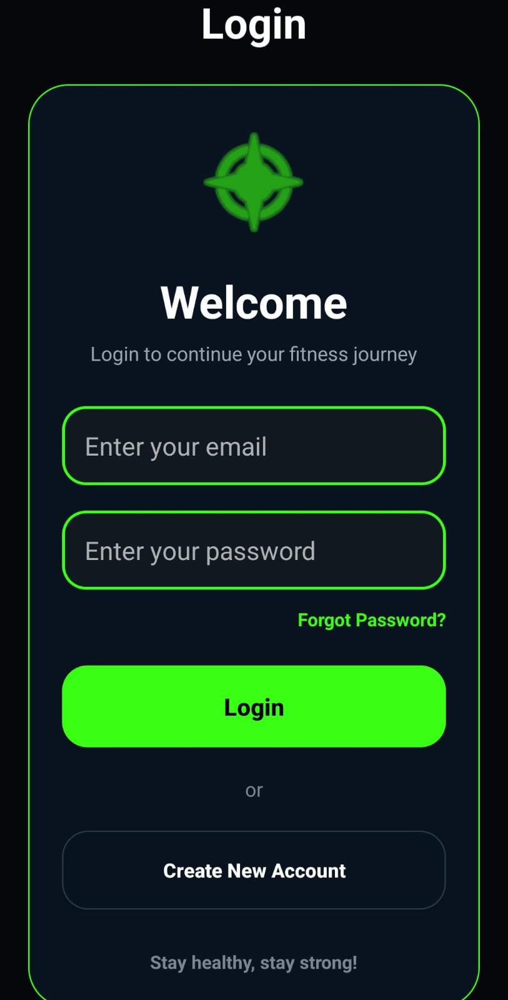

## 🏠 Dashboard

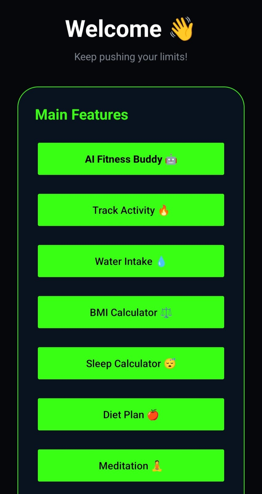

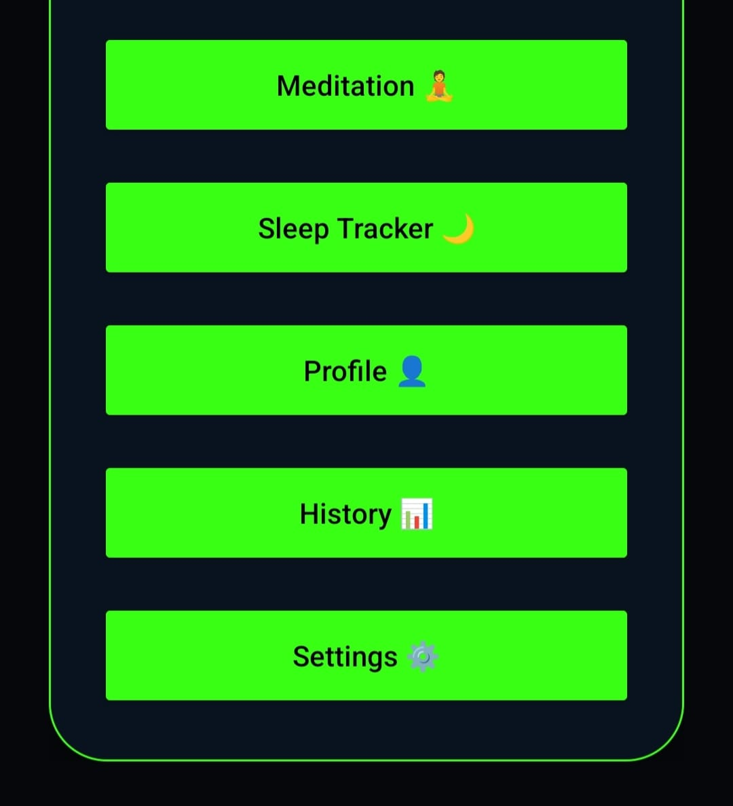

## 🚶 Activity Tracker

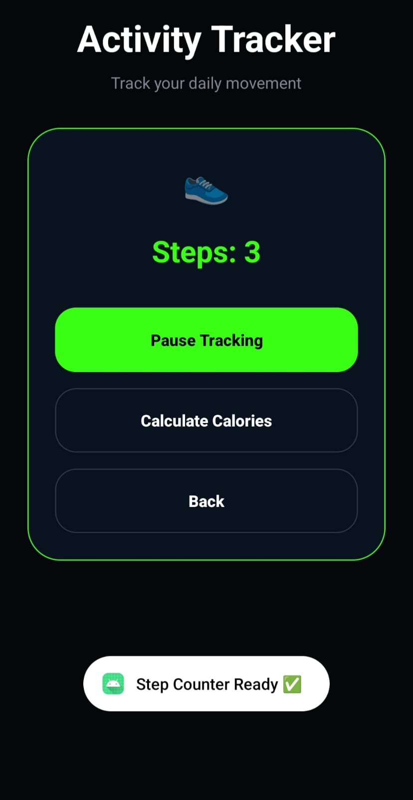

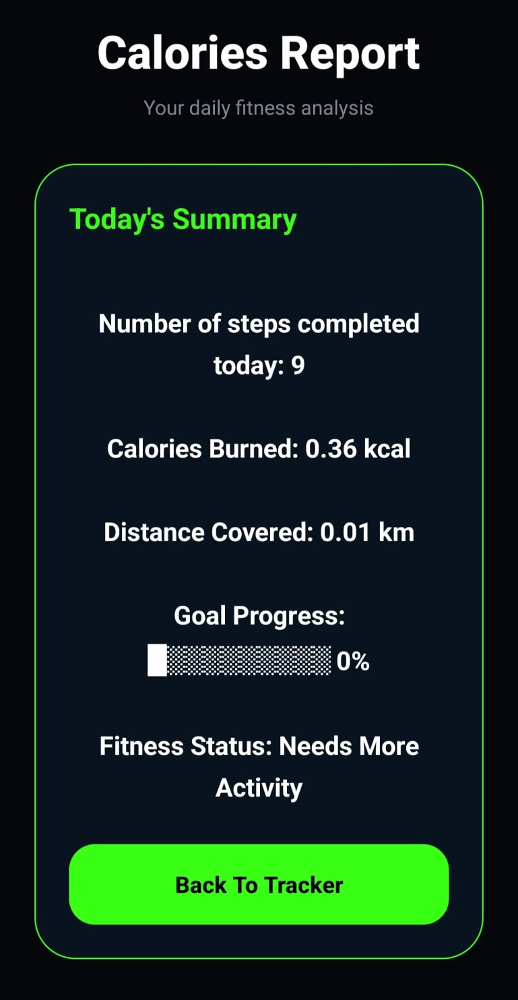

## 🤖 AI Fitness Buddy Chatbot

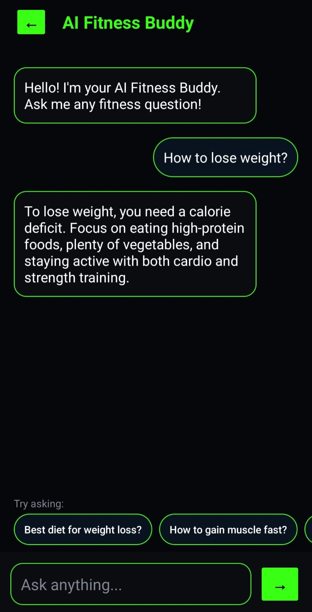

## 💧 Water Intake Tracker

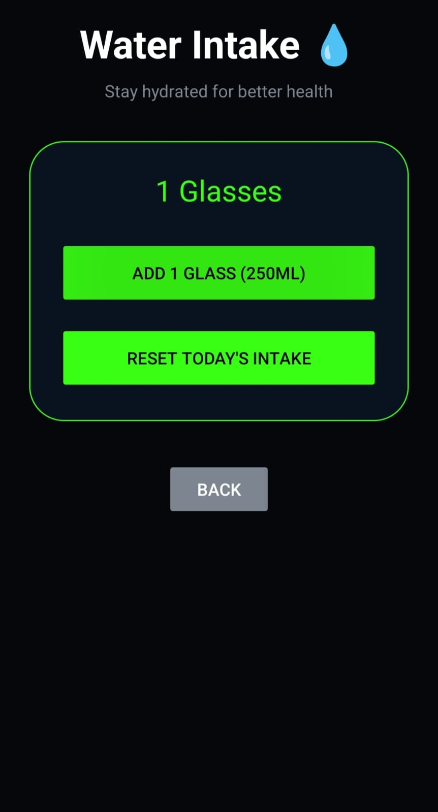

## ⚖️ BMI Calculator

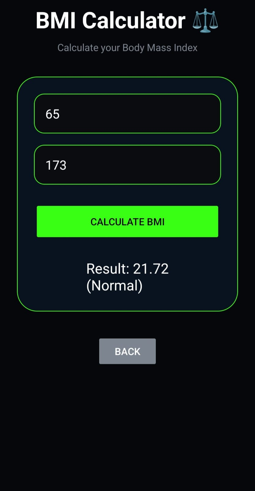

## 🛌 Sleep Tracker

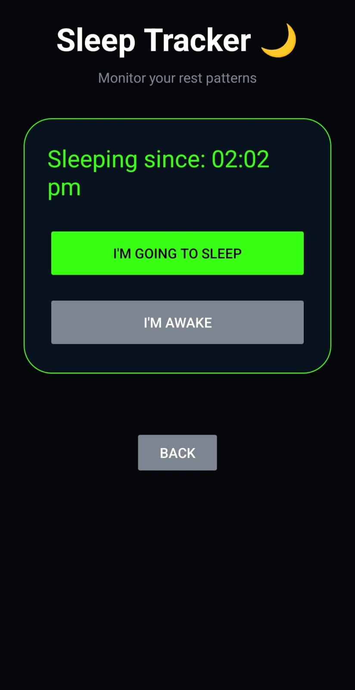

## 🥗 Diet Plan

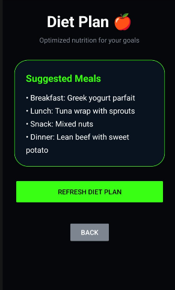

## 🧘 Meditation Timer

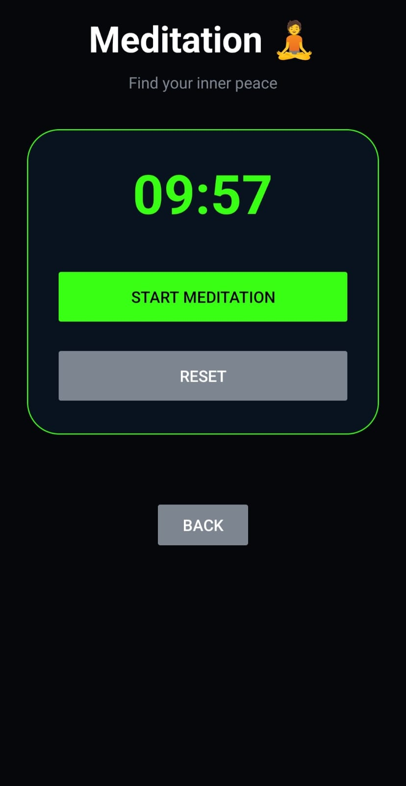

## 👤 User Profile

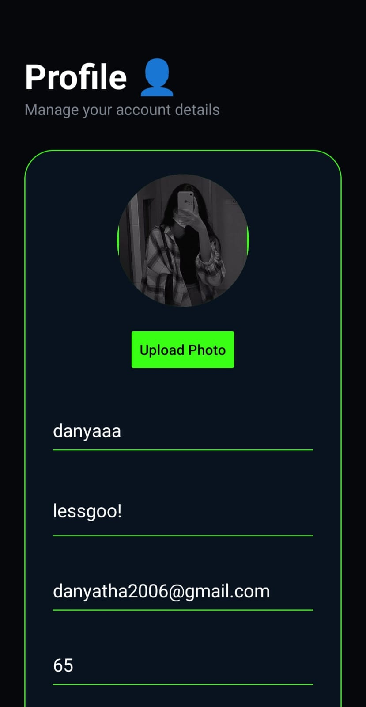

## ⚙️ Settings

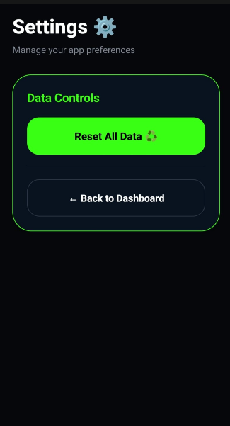
# 🔮 Future Enhancements

- Google Fit Integration
- Smart Watch Integration
- Workout Reminder Notifications
- Weekly & Monthly Reports
- Cloud Data Synchronization
- Dark/Light Theme Support
- Personalized AI Workout Plans
- Health Analytics Dashboard

---

## 🎥 Project Demonstration

[▶️ Watch Project Demo](Video/demo.mp4)

---

## Report

# 👨‍💻 Developed By

**Danyatha Y K**

Android Developer | AI & IoT Enthusiast

---

